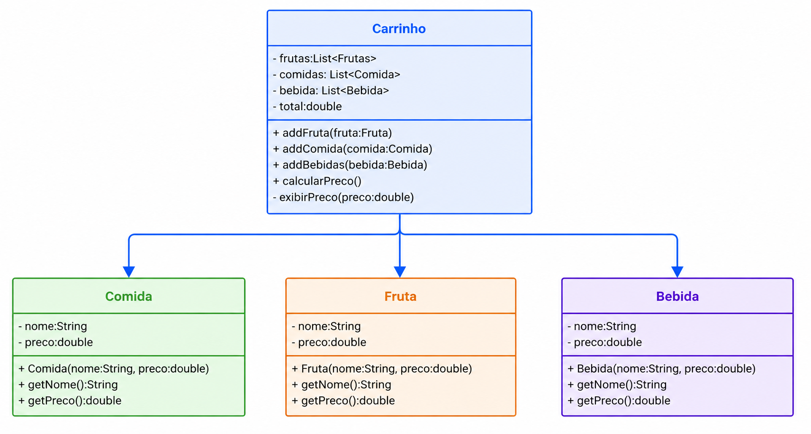

## Antipadrão Composite

O principal problema é a duplicação de atributos de coleção e de métodos em cada nova classe incorporada à estrutura. Além disso, os objetos não apresentam uma interface uniforme, fazendo com que o usuário precise conhecer as particularidades e diferenças de cada tipo de objeto para utilizá-los corretamente.

