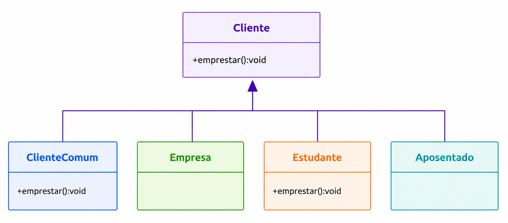

# Strategy Antipattern

Esse antipadrão utiliza herança para variar comportamentos, o que pode gerar duplicação de código e forte dependência entre a classe pai e suas subclasses. Como consequência, mudanças na estrutura da hierarquia podem exigir alterações em várias classes.

