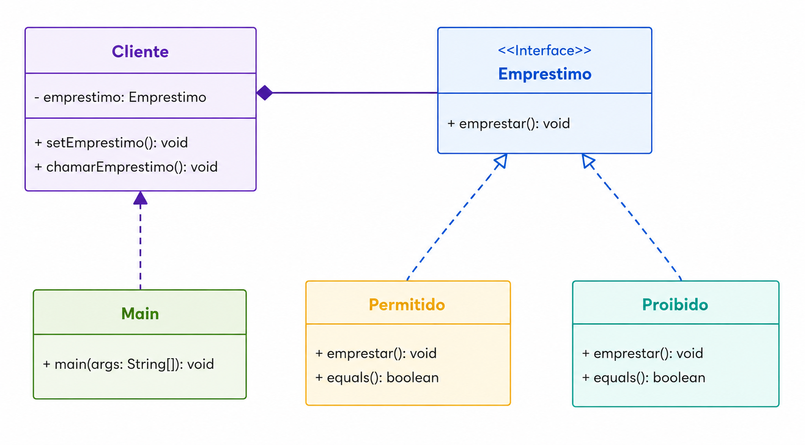

# Strategy Pattern
O Strategy é um padrão de projeto comportamental que permite encapsular uma família de algoritmos em classes distintas, tornando-os intercambiáveis durante a execução do programa. Dessa forma, o comportamento de um objeto pode ser alterado dinamicamente sem a necessidade de modificar seu código.

